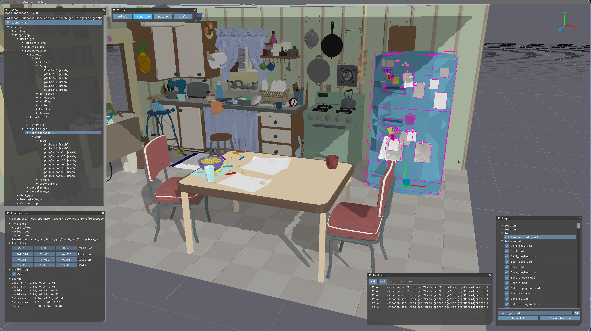
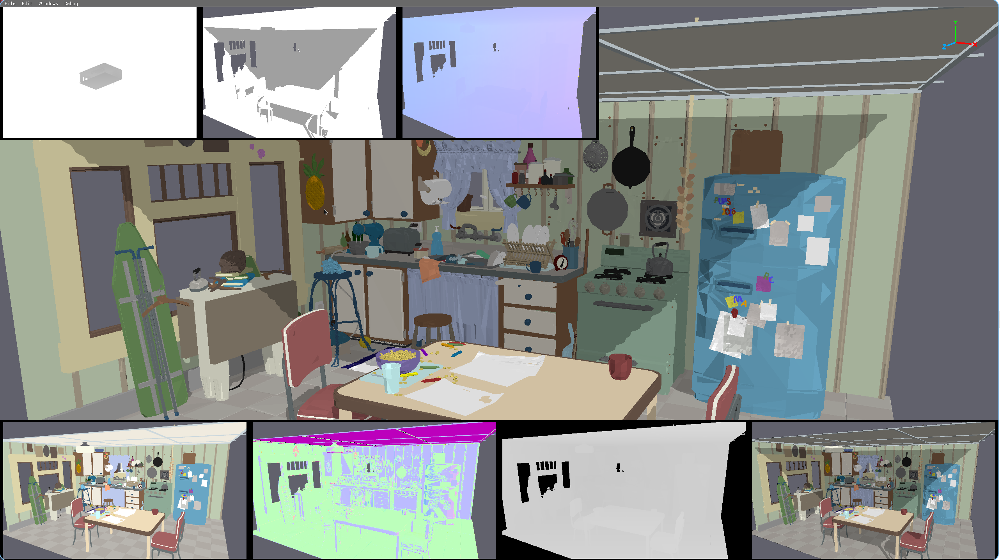
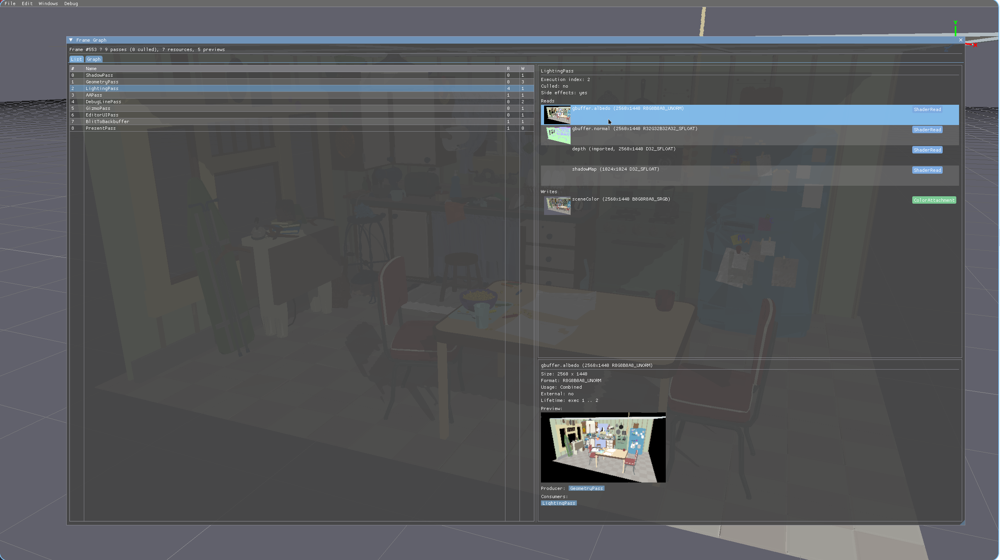
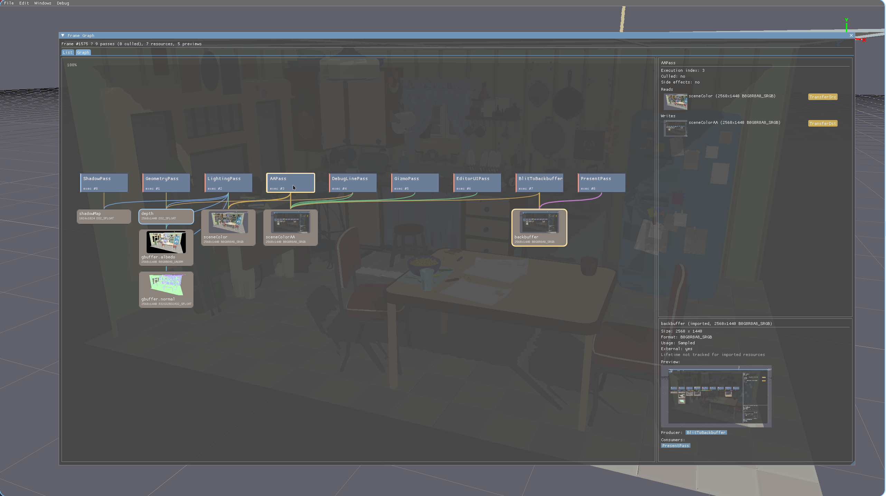
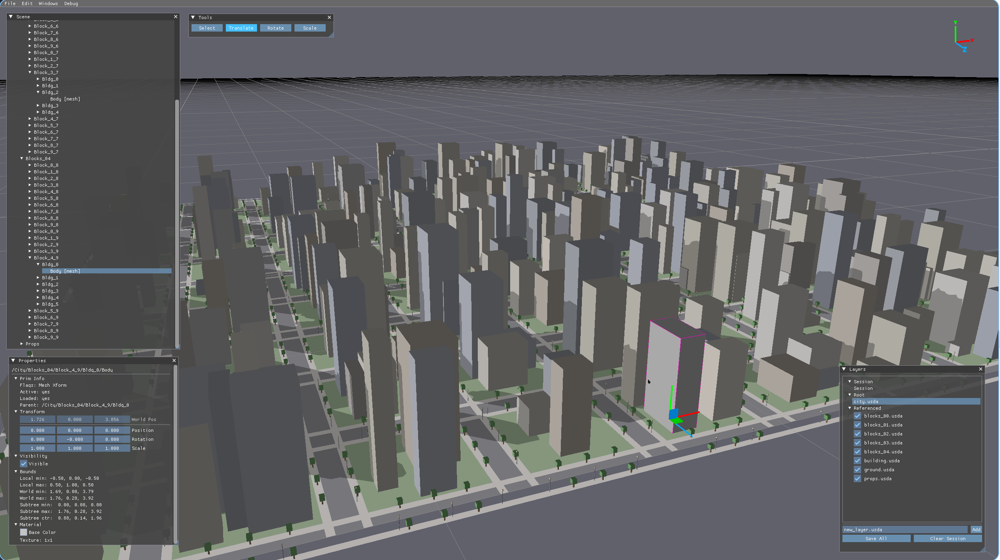

# ngen

A modern 3D engine written in C++23 with a Vulkan rendering backend and OpenUSD scene system.



## Features

- **Deferred Lighting** — G-buffer pass (albedo + normals MRT) followed by a fullscreen lighting pass with directional + ambient shading
- **G-buffer Debug Views** — Fullscreen buffer visualization (Albedo, Normals, Depth, Lit) and a toggleable bottom-strip overlay showing all buffers simultaneously
- **Threaded Rendering** — Pipelined main/render thread architecture with snapshot-based handoff, allowing the main thread to run one frame ahead of the render thread
- **Vulkan Renderer** — Dynamic rendering (VK_KHR_dynamic_rendering), synchronization2 barriers, dynamic viewport/scissor
- **Frame Graph** — Declarative render pass system with automatic dependency resolution, topological sorting, pass culling, write-chain ordering, and barrier insertion
- **Transient Resource Management** — Pool-based GPU resource allocation with lifetime tracking
- **RHI Abstraction** — Backend-agnostic GPU interface, currently implemented for Vulkan
- **Swapchain Recreation** — Automatic resize handling with resource pool flushing
- **OpenUSD Scene System** — Stage loading, layer stack, composition, sublayer management
- **Scene Graph UI** — Hierarchical tree view with selection, raycast picking, context menus, auto-scroll-to-selection
- **Property Inspector** — Transform (local + world), visibility, bounds (own + subtree), material inspection; values are click-to-select-and-copy
- **Gizmos** — Translate (single-axis arrows + plane handles for 2-axis movement), Rotate (per-axis circles), Scale (per-axis with position compensation to scale from the anchor). All gizmos anchor on the visible mesh (walks up `!resetXformStack!` ancestors and uses subtree bounds for Xform parents)
- **Tools Window** — Select / Translate / Rotate / Scale tool selector; Select mode disables gizmo handles for click-through picking
- **Orientation Gizmo** — Corner viewport with X/Y/Z axis indicator, billboarded labels, and click-to-snap-to-axis
- **Undo / Redo** — Per-frame snapshot stack with `Ctrl+Z` / `Ctrl+Shift+Z`, an Edit menu, and a History panel listing entries with their target prim
- **Preview / Authoring Edit Pipeline** — Interactive operations (gizmo drag, Properties slider scrub) emit transient `Preview` edits that only touch the runtime cache; one final `Authoring` edit commits to the USD layer on operation end. Keeps interactive frames at microseconds and gives undo a meaningful commit boundary
- **Incremental Scene Updates** — Fast path applies transform edits inline (no async batch, no library copies, no descriptor rebuilds) and patches only the affected `RenderWorld` instances + BVH leaves
- **Layer Management** — Full layer stack (session, root, sublayers, referenced), mute/unmute, add/save
- **Debug Renderer** — Line-based debug drawing (AABBs, selection highlights)
- **Job System** — Thread pool with fence-based synchronization for background work
- **Background Scene Updates** — Heavyweight edits (visibility, sublayer ops, resyncs) processed on worker threads
- **Incremental GPU Upload** — Resource caching, transform-only fast path
- **Material Support** — UsdPreviewSurface textures, displayColor primvars, constant colors
- **Up Axis Handling** — Automatic Z-up to Y-up conversion
- **FPS Camera** — WASD movement, right-click mouse look, snap-to-axis via the corner orientation gizmo

## Architecture

```
App (main.cpp)
 ├─ JobSystem (jobsystem/)   — Static thread pool, fence-based sync
 ├─ Scene (scene/)           — USD loading, mesh/texture/material extraction
 │   ├─ USDScene             — Stage, layers, prim cache, transforms, change notifications
 │   ├─ USDRenderExtractor   — Extract render data from composed stage; incremental patchTransforms
 │   ├─ SceneUpdater         — Fast path for transform edits + async batch for heavier ops
 │   ├─ UndoStack            — Per-frame snapshot stack of inverse SceneEditCommands
 │   ├─ SceneQuerySystem     — Spatial queries (raycast, frustum), gizmo anchor resolution
 │   └─ BoundsCache          — AABB caching for prims
 ├─ EditorUI (ui/)           — ImGui panels: Scene, Properties, Layers, Tools, History
 │   ├─ TranslateGizmo       — Axis arrows + plane handles for 1- or 2-axis translation
 │   ├─ RotateGizmo          — Per-axis ring drag with world→local rotation conversion
 │   ├─ ScaleGizmo           — Per-axis scale with position compensation + local axis mapping
 │   └─ Edit/Windows menus   — Undo/Redo, Select Parent, Frame Selected, panel toggles
 └─ Renderer (renderer/)     — Frame graph, resource pool, GPU mesh management
     ├─ RenderThread         — Dedicated render thread with snapshot-based handoff
     ├─ RenderSnapshot       — Per-frame value-type snapshot (matrices, settings, ImGui, debug, gizmo verts)
     ├─ FrameGraph           — Pass declaration, compilation, execution
     │   ├─ GeometryPass     — G-buffer MRT (albedo + normals + depth)
     │   ├─ LightingPass     — Fullscreen deferred shading from G-buffer
     │   ├─ DebugLinePass    — Debug line drawing (AABBs, highlights)
     │   ├─ GizmoPass        — Wide-line world-space gizmo geometry
     │   └─ EditorUIPass     — ImGui overlay (cloned draw data from main thread)
     ├─ ResourcePool         — Transient texture pooling
     ├─ DebugRenderer        — Debug line pass setup
     └─ RHI (rhi/)           — Abstract device, swapchain, command buffer interfaces
         └─ Vulkan (rhi/vulkan/)  — Vulkan 1.3 backend
```

### Threading Model

```
Frame N:   [Main: update + prepare]  -->  [Render: build FG + record CB + submit]  -->  [GPU: execute]
Frame N+1: [Main: update + prepare]  -->  [Render: ...]                             -->  ...
```

The main thread prepares a `RenderSnapshot` each frame containing view/projection matrices, render settings, deep-copied ImGui draw data, debug geometry, and the active gizmo's vertex buffer (translate, rotate, or scale). This snapshot is handed off to a dedicated render thread via a single-slot condvar with back-pressure (main blocks if the render thread hasn't consumed the previous snapshot). Scene uploads (mesh/texture data) travel through a separate channel and are processed at the start of each render frame.

### Edit Pipeline

Interactive operations follow a **Preview → Authoring** lifecycle (see `docs/architecture_preview_vs_authoring.md`). Each frame the user is dragging a gizmo or scrubbing a slider, the engine emits one or more `Preview` `SceneEditCommand`s — the `SceneUpdater` fast path applies them directly to the runtime transform cache, patches only the affected `RenderWorld` instances and BVH leaves, and skips USD entirely. On operation end (mouse-up, slider release) one `Authoring` edit commits the final value to the active USD layer; that commit is the undo step. Heavyweight edits (`SetVisibility`, layer mutes, sublayer ops, resyncs) take the existing async batch path through a worker thread.

### Lighting & Shadows

Deferred directional lighting with hard shadow mapping. The `GeometryPass` writes albedo / normals / depth into a G-buffer; `ShadowPass` renders the scene's depth from the first directional light's point of view into a 1024² shadow map; the fullscreen `LightingPass` reconstructs each fragment's world-space position from the G-buffer depth and the inverse view-projection, projects it into light-clip space, and compares against the shadow map to modulate the diffuse term. The shadow ortho is auto-fitted to a bounding sphere around the instance origins each frame, so it scales to whatever scene you load. Dedicated debug views (`Shadow Map`, `Shadow Factor`, `Shadow UV`, `World Pos`) are available under **Debug → Fullscreen Buffer View** and as a top-strip overlay via **Debug → Show Shadow Overlay**.



### Frame Graph Debugger

The Frame Graph window (**Debug → Frame Graph**) exposes every render pass and the resources flowing between them, with live thumbnails blitted from each color target each frame. Two views of the same graph:

**List view** — passes in execution order with their reads and writes; clicking any row pins the full resource details (size, format, lifetime, producer, consumers) in the bottom pane.



**Graph view** — passes arranged across a single row at the top, with resources stacked directly beneath their producer. Edges are access-colored and highlight when either endpoint is selected. Pan with middle-drag (or left-drag on empty canvas); scroll to zoom.



## Dependencies

| Library | Purpose |
|---------|---------|
| [SDL3](https://github.com/libsdl-org/SDL) | Window creation, input, Vulkan surface, file dialogs |
| [Vulkan SDK](https://vulkan.lunarg.com/) | GPU API + glslc shader compiler |
| [GLM](https://github.com/g-truc/glm) | Math (vectors, matrices, quaternions) |
| [stb](https://github.com/nothings/stb) | Image loading (stb_image) |
| [Dear ImGui](https://github.com/ocornut/imgui) | Editor UI |
| [OpenUSD](https://github.com/PixarAnimationStudios/OpenUSD) | USD scene format (stage, layers, composition) |

GLM, stb, Dear ImGui, and OpenUSD are included as git submodules in `external/`. SDL3 and the Vulkan SDK must be installed on the system.

After cloning, initialize the submodules:

```bash
git submodule update --init --recursive
```

## Building OpenUSD

OpenUSD must be built separately before building the engine. This only needs to be done once. Requires CMake and Python 3.

```bash
python3 external/openusd/build_scripts/build_usd.py \
  --no-python --no-imaging --no-tests --no-examples \
  --no-tutorials --no-tools --no-docs --no-materialx \
  --no-alembic --no-draco --no-openimageio --no-opencolorio \
  --no-openvdb --no-ptex --no-embree --no-prman \
  --onetbb --build-variant release \
  -j$(nproc) \
  external/openusd_build
```

## Building

Requires clang++ with C++23 support and the Vulkan SDK. OpenUSD must be built first (see above).

```bash
make
```

Shaders are compiled from GLSL to SPIR-V automatically via `glslc`.

## Usage

```bash
./_out/ngen [scene.usd]
```

Or launch without arguments and use File > Open.

### Controls

| Input | Action |
|-------|--------|
| WASD | Move camera |
| Q / E | Move down / up |
| Shift | Sprint (3× speed) |
| Right mouse button | Hold to look around |
| Left click | Pick object (Select tool) or grab gizmo handle (Translate / Rotate / Scale) |
| **R** | Select parent of current selection |
| **F** | Frame the selected prim in the camera view |
| **Ctrl+Z** | Undo last commit |
| **Ctrl+Shift+Z** | Redo |
| **Ctrl+E** | Toggle Scene / Properties / Layers / Tools panels |

### Test Scenes

Generated city scenes of varying sizes are included:

```bash
./_out/ngen models/city/city_1x1/city.usda    # 1 block
./_out/ngen models/city/city_5x5/city.usda    # 25 blocks
./_out/ngen models/city/city_10x10/city.usda  # 100 blocks
./_out/ngen models/city/city_20x20/city.usda  # 400 blocks
```

Regenerate with `python3 models/city/generate_city.py`.

## Screenshots


