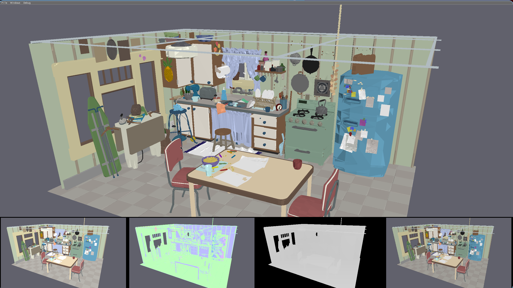
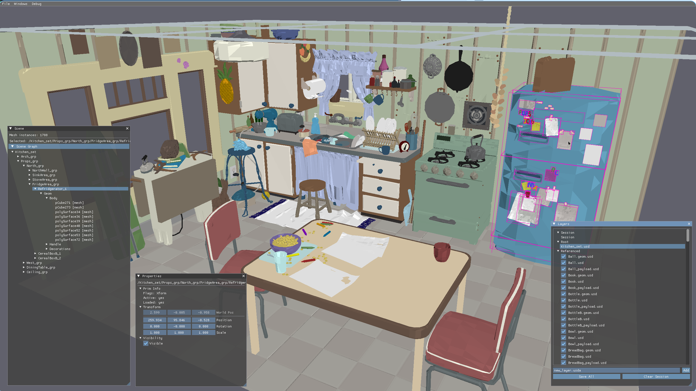

# ngen

A modern 3D engine written in C++23 with a Vulkan rendering backend and OpenUSD scene system.




## Features

- **Deferred Lighting** — G-buffer pass (albedo + normals MRT) followed by a fullscreen lighting pass with directional + ambient shading
- **G-buffer Debug Views** — Fullscreen buffer visualization (Albedo, Normals, Depth, Lit) and a toggleable bottom-strip overlay showing all buffers simultaneously
- **Vulkan Renderer** — Dynamic rendering (VK_KHR_dynamic_rendering), synchronization2 barriers
- **Frame Graph** — Declarative render pass system with automatic dependency resolution, topological sorting, pass culling, write-chain ordering, and barrier insertion
- **Transient Resource Management** — Pool-based GPU resource allocation with lifetime tracking
- **RHI Abstraction** — Backend-agnostic GPU interface, currently implemented for Vulkan
- **OpenUSD Scene System** — Stage loading, layer stack, composition, sublayer management
- **Scene Graph UI** — Hierarchical tree view with selection, raycast picking, context menus
- **Property Inspector** — Transform (local + world), visibility, bounds, material inspection
- **Layer Management** — Full layer stack (session, root, sublayers, referenced), mute/unmute, add/save
- **Debug Renderer** — Line-based debug drawing (AABBs, selection highlights)
- **Job System** — Thread pool with fence-based synchronization for background work
- **Background Scene Updates** — Edit commands queued and processed on worker threads
- **Incremental GPU Upload** — Resource caching, transform-only fast path
- **Material Support** — UsdPreviewSurface textures, displayColor primvars, constant colors
- **Up Axis Handling** — Automatic Z-up to Y-up conversion
- **FPS Camera** — WASD movement, right-click mouse look

## Architecture

```
App (main.cpp)
 ├─ JobSystem (jobsystem/)   — Static thread pool, fence-based sync
 ├─ Scene (scene/)           — USD loading, mesh/texture/material extraction
 │   ├─ USDScene             — Stage, layers, prim cache, transforms, change notifications
 │   ├─ USDRenderExtractor   — Extract render data from composed stage
 │   ├─ SceneQuerySystem     — Spatial queries (raycast, frustum culling)
 │   └─ BoundsCache          — AABB caching for prims
 └─ Renderer (renderer/)     — Frame graph, resource pool, GPU mesh management
     ├─ FrameGraph           — Pass declaration, compilation, execution
     │   ├─ GeometryPass     — G-buffer MRT (albedo + normals + depth)
     │   ├─ LightingPass     — Fullscreen deferred shading from G-buffer
     │   ├─ DebugLinePass    — Debug line drawing (AABBs, highlights)
     │   └─ EditorUIPass     — ImGui overlay
     ├─ ResourcePool         — Transient texture pooling
     ├─ DebugRenderer        — Debug line pass setup
     └─ RHI (rhi/)           — Abstract device, swapchain, command buffer interfaces
         └─ Vulkan (rhi/vulkan/)  — Vulkan 1.3 backend
```

## Dependencies

| Library | Purpose |
|---------|---------|
| [SDL3](https://github.com/libsdl-org/SDL) | Window creation, input, Vulkan surface, file dialogs |
| [Vulkan SDK](https://vulkan.lunarg.com/) | GPU API + glslc shader compiler |
| [GLM](https://github.com/g-truc/glm) | Math (vectors, matrices, quaternions) |
| [stb](https://github.com/nothings/stb) | Image loading (stb_image) |
| [Dear ImGui](https://github.com/ocornut/imgui) | Editor UI |
| [OpenUSD](https://github.com/PixarAnimationStudios/OpenUSD) | USD scene format (stage, layers, composition) |

GLM, stb, Dear ImGui, and OpenUSD are included as git submodules in `external/`. SDL3 and the Vulkan SDK must be installed on the system.

After cloning, initialize the submodules:

```bash
git submodule update --init --recursive
```

## Building OpenUSD

OpenUSD must be built separately before building the engine. This only needs to be done once. Requires CMake and Python 3.

```bash
python3 external/openusd/build_scripts/build_usd.py \
  --no-python --no-imaging --no-tests --no-examples \
  --no-tutorials --no-tools --no-docs --no-materialx \
  --no-alembic --no-draco --no-openimageio --no-opencolorio \
  --no-openvdb --no-ptex --no-embree --no-prman \
  --onetbb --build-variant release \
  -j$(nproc) \
  external/openusd_build
```

## Building

Requires clang++ with C++23 support and the Vulkan SDK. OpenUSD must be built first (see above).

```bash
make
```

Shaders are compiled from GLSL to SPIR-V automatically via `glslc`.

## Usage

```bash
./_out/ngen [scene.usd]
```

Or launch without arguments and use File > Open.

### Controls

| Input | Action |
|-------|--------|
| WASD | Move camera |
| Q / E | Move down / up |
| Shift | Sprint (3x speed) |
| Right mouse button | Hold to look around |
| Left click | Pick object |

### Test Scenes

Generated city scenes of varying sizes are included:

```bash
./_out/ngen models/city/city_1x1/city.usda    # 1 block
./_out/ngen models/city/city_5x5/city.usda    # 25 blocks
./_out/ngen models/city/city_10x10/city.usda  # 100 blocks
./_out/ngen models/city/city_20x20/city.usda  # 400 blocks
```

Regenerate with `python3 models/city/generate_city.py`.
